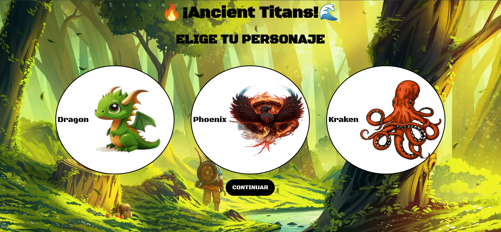
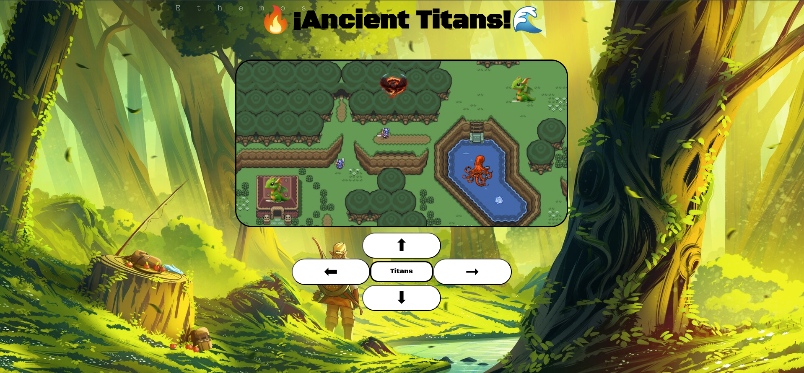
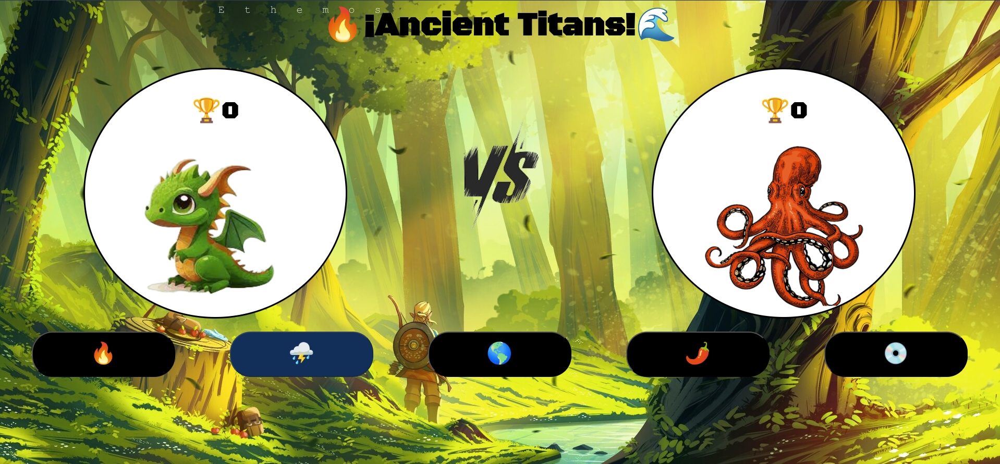

# Ancient Titans

Link: https://andres-bermudez.github.io/Ancient-Titans/

- Bienvenido al juego:

### Descripcion:
Este proyecto es un juego web realizado utilizando HTML, CSS y
JavaScript. Lo hice a partir del curso gratis de programacion
basica en platzi y me sirvio para conocer las tecnologias de 
la web y entrenar la logica de programacion.

La logica del juego es sencilla, existen 3 personajes, cada uno
con poderes diferentes y el jugador puede elegir uno de ellos
y luego elegir su contendiente moviendose por un mapa hecho en
canvas, para luego enfrentarse en una batalla de habilidades
epica.

- Mapa en canvas:

##### Nota:
Era muy novato cuando hice este proyecto, el codigo es un
caos, pero en ese momento yo me sentia poderoso por hacerlo 
funcionar :), decidi no refactorizarlo para recordar mis primeros
pasos en la programacion.

- Combate de personajes:

